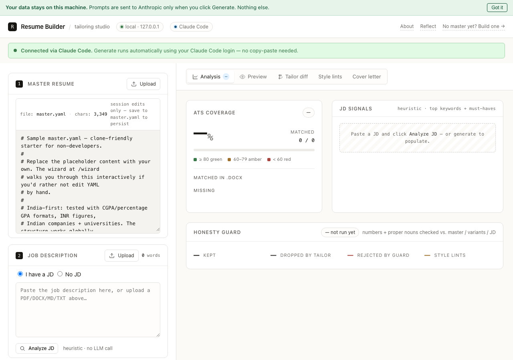
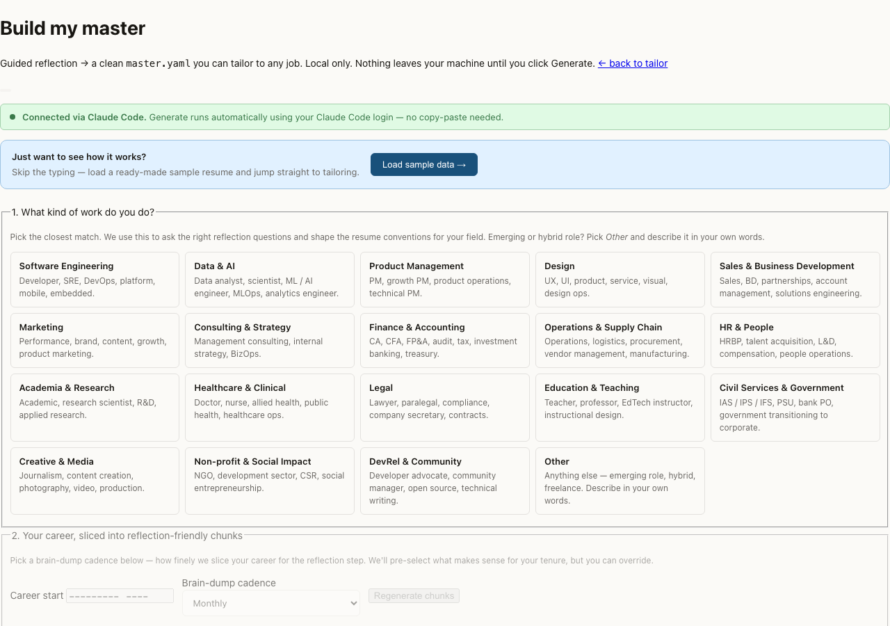
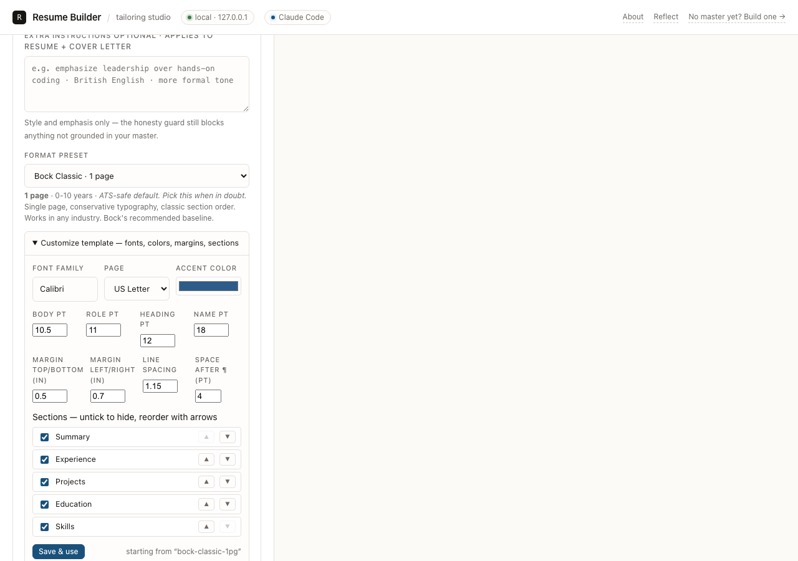
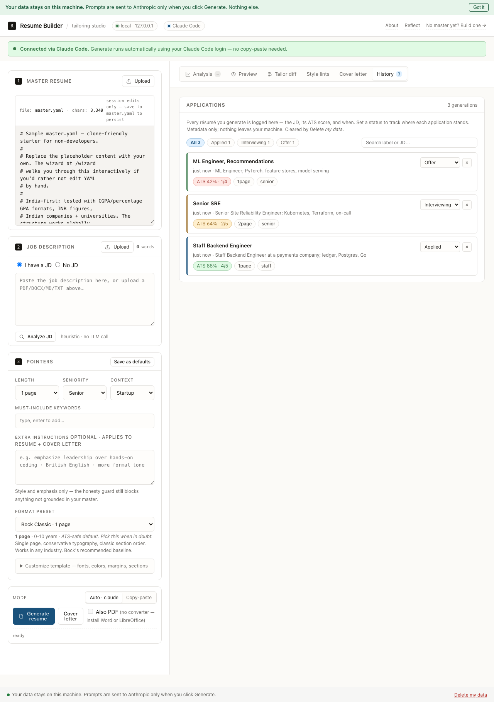

# Resume Builder

[](https://github.com/mapqrs/resume-builder/actions/workflows/ci.yml)
[](LICENSE)

A local-only tool that turns a structured "master resume" into a JD-tailored
`.docx` (or `.pdf`) — plus a matching cover letter and a LinkedIn profile.
The same data, polished three different ways for the three places a recruiter
will look.

It never invents experience, projects, or metrics. A fabrication guard runs
on every output and drops anything the source doesn't support.

> **Your data stays on this machine.** Prompts go to Anthropic only when you
> click **Generate**. Nothing else leaves your laptop — no telemetry, no
> "anonymous usage stats," no account system.



<details>
<summary>More screenshots — the wizard, template customizer, and application tracker</summary>







</details>

## What it does

- **Wizard** that walks you through a guided brain-dump of every job, project,
  degree, and award. Captures raw memories first, then turns them into
  Bock-format bullets you approve one at a time. **Already have a résumé?**
  Import it (upload or paste) and the wizard pre-fills your basics, education,
  skills, and one career chunk per job — the whole flow becomes a review pass.
- **Tailor** that adapts your master resume to a specific JD (or a "target
  role" if you don't have a JD yet) and outputs a Word `.docx` or PDF.
- **Cover-letter writer** that mirrors the same anti-fabrication rules.
- **LinkedIn profile builder** — Headline / About / Experience / Featured /
  Skills / Education as copy-paste blocks. Same guard.
- **ATS coverage report** so you see what JD keywords your final resume
  actually hits before you submit.
- **Customizable everything** — format presets you can fork (fonts, sizes,
  colors, margins, section order), freeform style instructions for the AI,
  and one-click "save as my defaults" for your usual knobs.

India-first defaults: CGPA/percentage GPA, INR figures, Indian education
conventions (dropout/deferred-admit/online-only education statuses are
first-class). The structure works globally.

## Quick start (non-developer)

```bash
./run-web.sh        # macOS / Linux
run-web.bat         # Windows (double-clicking it in Explorer works too)
```

That's it. The first run sets everything up for you — it creates a private
Python environment, installs dependencies (about 30 seconds, once), then
launches the app and **opens your browser** at <http://127.0.0.1:5005>.
Every run after that just launches.

You need Python 3.9+ — if it's missing or too old, the script tells you
exactly how to install it.

> Prefer to set it up by hand (or the script can't find your Python)? Create
> the venv yourself: `python3 -m venv .venv`, `source .venv/bin/activate`,
> `pip install -r requirements.txt`, then `./run-web.sh`.

The first time you run it (no `master.yaml` in the folder yet), it'll
drop you straight into the **wizard** at `/wizard`. If you already have a
résumé, **step 0 imports it** — upload the PDF/DOCX or paste the text, and
the wizard pre-fills everything so the steps below are just review. Starting
from scratch instead? Follow the 10 steps top-to-bottom — pick your role
family, brain-dump each chunk of your career, watch the AI turn dumps into
Bock bullets, categorize them, polish the rough ones, fill in education and
basics, click **Save master**. About 30 minutes from cold start (or ~10 with
an imported résumé) to a working `master.yaml`.

Your wizard sessions are listed in a **"Your sessions"** bar at the top of
the wizard — close the tab anytime and pick up where you left off.

After that, the home page (`/`) loads with your master pre-filled. Paste
a JD, pick length + seniority, click **Generate resume**. You get back a
`.docx` (and optionally a `.pdf`) in under a minute.

### Try it with sample data first

If you'd rather see the whole pipeline before typing your own resume,
copy the example fixture:

```bash
cp samples/master.example.yaml master.yaml
./run-web.sh
# upload samples/jd.example.txt as the JD, click Generate.
```

That gives you a tailored `.docx` for a fictional Bengaluru-based
fintech engineer applying to a payments role — useful for seeing the
output shape end-to-end.

## How tailoring stays honest

Claude returns structured JSON where every output bullet has a
`source_id` pointing back to a master bullet. The **no-invention guard**:

1. Rejects any `source_id` not in the master.
2. Extracts numbers and proper nouns from each rewritten bullet and
   asserts they appear in the source bullet's `text` OR its `variants`
   OR the JD OR your must-include allowlist.
3. Drops bullets that fail and surfaces a warning.

The guard runs after every tailoring path (auto, copy-paste, re-render).
Same guard runs on cover-letter paragraphs and every LinkedIn section.
Fabrication is detected, not assumed-away.

## Web UI panels

Seven panels surface after generation:

- **JD signals** — what the heuristic extractor pulled from your JD
  (must-haves, top keywords, inferred seniority, role archetype). Click
  **Analyze JD** to see it before generating.
- **ATS coverage** — percentage of JD keywords your `.docx` actually
  contains. Green ≥80%, yellow 60–79%, red <60%. Workday / Greenhouse /
  Lever filter on these.
- **Guard warnings** — bullets the no-invention guard dropped, with the
  specific rogue numbers / proper nouns.
- **Style suggestions** — advisory lints (clichés, repeated verbs,
  missing impact, length drift).
- **What the tailor did** — side-by-side master ↔ tailored diff. Each
  master bullet is classified: kept (rewritten), dropped by tailor, or
  dropped by guard with the rejection reason.
- **Cover letter** — when you generate one, the plain-text version
  appears inline alongside the `.docx`. Guard warnings (numbers/proper
  nouns not grounded in the master) surface here too. Unlike the resume
  guard, cover-letter paragraphs are kept whole — warnings are advisory.
- **History** — every résumé you generate is logged (the JD, its ATS
  score, the length/seniority you used, and when). Set a **status** on
  each (saved → applied → interviewing → offer → rejected) and
  filter/search the list, so the tab doubles as a job-search pipeline
  board. Metadata only by default; tick **Keep a copy** before Generate
  to also store that `.docx` locally for one-click re-download later.
  Everything here is wiped by **Delete my data**.

## Make it yours

Everything about the output is customizable from the UI — no YAML editing
required (though hand-editing still works):

- **Format presets** — Bock Classic (1 page), Detailed (2 pages), Modern
  Compact. Pick one in the Pointers card; each carries guidance on who
  it's for.
- **Customize template** — open the "Customize template" panel under the
  preset picker to change font family, per-role sizes, accent color,
  margins, line spacing, and to **hide or reorder sections**
  (summary/experience/projects/education/skills). "Save & use" writes
  `template.yaml` and adds a "Custom · template.yaml" preset. The CLI
  picks up the same file via `--template template.yaml`.
- **Extra instructions** — a freeform box in the Pointers card ("emphasize
  leadership", "British English", "more formal tone") applied to both the
  resume tailor and the cover-letter writer. Style only: the honesty guard
  still blocks anything not grounded in your master. CLI:
  `--extra-instructions "..."`.
- **Save as defaults** — one click persists your usual length / seniority /
  context / must-include keywords / extra instructions to `pointers.yaml`;
  they pre-fill every future session and feed the CLI's `--pointers`.

## No JD on hand?

The "I have a JD" / "No JD" toggle in fieldset 2 lets you describe a
**target role** instead — role, seniority, industry, company size,
must-include keywords. The tool synthesizes JD-like signals from a small
role-keyword table so the tailor + ATS pipeline still works.

Common India-friendly role names work out of the box: Backend, Frontend,
Fullstack, Data Engineer, ML Engineer, SRE, Mobile, Product Manager,
Designer, Analyst.

## PDF export

Tick **Also PDF** before Generate. Requires one of:

- **Microsoft Word** (on macOS or Windows) — via `docx2pdf`.
- **LibreOffice** (cross-platform) — via `libreoffice --headless`.

The web UI auto-detects which one is installed and disables the
checkbox if neither is. CLI users add `--format pdf`.

If neither is available, open the `.docx` in any Word-compatible editor
and File → Save As → PDF. Bock recommends PDF for ATS submissions.

## LinkedIn profile

After saving your master in the wizard, scroll to step 10 ("LinkedIn
profile"). Click **Generate LinkedIn profile** — it makes four LLM calls
(headline, about, experience, featured) and gives you copy-paste blocks
for every LinkedIn section. Same anti-fabrication guard, same character
limits LinkedIn enforces.

No LinkedIn API integration; this is local copy-paste only.

## Privacy + delete-my-data

Your data lives in three places on disk:

- `master.yaml` — your actual resume.
- `sessions/` — wizard session state (one folder per session).
- `master.yaml.bak.<timestamp>` — automatic backups created each time
  you Save Master.

The **Delete my data** button in the footer wipes `sessions/` and every
`master.yaml.bak.*` (your current `master.yaml` is left alone). The
endpoint also wipes `drafts/` if it exists (legacy directory from an
older release).

Nothing ever leaves the loopback interface (`127.0.0.1`). The only
network call is to Anthropic when you click **Generate** — and that
only happens with either:

- A working `claude` CLI login (your existing Claude Code subscription)
- An `ANTHROPIC_API_KEY` environment variable

If neither is available, the tool falls back to **copy-paste mode**:
shows you the prompt, you paste it into any Claude session, you paste
the reply back. No network call from this app at all.

## CLI

For automation, scripting, or terminal-first workflow:

### Mode 1 — auto (recommended)

If `claude` (Claude Code CLI) is logged in on your terminal, this just
works:

```bash
python -m resume_builder \
  --master master.yaml \
  --jd jds/acme-staff-eng.txt \
  --length 1page \
  --seniority staff \
  --must-include "Kubernetes,Postgres" \
  --context startup \
  --template template.yaml \
  --out out/acme-staff-eng.docx \
  --format pdf
```

`--format pdf` writes a `.pdf` next to the `.docx` (requires Word or
LibreOffice — see PDF export above).

### Mode 2 — copy-paste (always works)

If you're in an environment where `claude` isn't authenticated, run in
two steps:

```bash
# 1. Generate the prompt
python -m resume_builder \
  --master master.yaml \
  --jd jds/acme-staff-eng.txt \
  --length 1page --seniority staff --context startup \
  --print-prompt /tmp/prompt.txt

# 2. Paste /tmp/prompt.txt into any Claude session.
#    Save Claude's JSON reply to /tmp/reply.json (just the JSON).

# 3. Run guard + render
python -m resume_builder \
  --master master.yaml \
  --jd jds/acme-staff-eng.txt \
  --from-response /tmp/reply.json \
  --template template.yaml \
  --out out/acme-staff-eng.docx
```

### Mode 3 — render only (no tailoring)

```bash
python -m resume_builder --master master.yaml \
  --template template.yaml --out out/raw.docx --no-tailor
```

## Files

- `master.yaml` — your source-of-truth resume (gitignored)
- `template.yaml` — formatting (font, size, margin, colors, section order)
- `pointers.yaml` — default per-run knobs
- `samples/` — starter `master.example.yaml` and `jd.example.txt`
- `jds/` — your JD text files
- `out/` — generated `.docx` / `.pdf`
- `sessions/` — wizard session state (auto-managed, wipe via Delete my data)
- `src/resume_builder/` — code
- `tests/` — pytest suite

## Authoring `master.yaml` by hand

Each bullet supports three optional metadata fields beyond `id` and `text`:

```yaml
- id: exp-acme-1
  text: "Led the dispatch rewrite from Ruby to Go, cutting p99 from 480ms to 95ms."
  tags: [backend, go, performance, leadership]
  impact_score: 5          # 1-5; tailor prefers higher under length pressure
  variants:                # alternate phrasings, all authored by you
    - "Drove the Ruby-to-Go rewrite of dispatch; p99 went from half a second to under 100ms."
    - "Owned the dispatch rewrite that cut tail latency by ~80% across 12M daily requests."
```

- **`tags`** — arbitrary labels. The tailor uses tag-overlap with the JD
  to pick which bullets to surface.
- **`impact_score`** — your honest 1-5 self-rating. Used as a tiebreaker
  when length forces a cut. Absent ≈ 3.
- **`variants`** — alternate phrasings of the same accomplishment. The
  tailor picks whichever variant's tone fits the JD. The no-invention
  guard treats every variant's vocabulary (numbers, tool names) as legal
  source material — they're true; you wrote them.

Education entries support a `status` field beyond the usual fields:
`graduated`, `in_progress`, `dropout`, `deferred_admit`, `rejected_admit`,
`on_leave`, `certification_only`, `online_only`. Dropouts / deferred
admits / on-leave entries get a `reason` field for position-of-strength
framing.

## Style lints (advisory)

After the guard, a separate `lints` pass surfaces taste-level issues
without dropping anything:

- **cliche** — "team player", "results-driven", "synergy", etc., with a
  one-line "do this instead" hint.
- **verb-diversity** — same opening verb across ≥3 bullets or >40% of
  the resume.
- **impact-density** — bullets without numbers when most siblings have them.
- **length** — total word count vs. the requested length pointer.
- **spellcheck** — basic English checks tuned for tech vocabulary.

CLI prints them under `[style lints]`; the web UI shows them in a
"Style suggestions" panel below the guard panel.

## Testing

```bash
PYTHONPATH=src .venv/bin/python -m pytest tests/
```

(Works without activating the venv. If you've activated it, plain
`PYTHONPATH=src pytest tests/` works too.)

## Setup with API key (optional)

If you'd rather use the Anthropic API directly (without Claude Code
CLI), export your key:

```bash
export ANTHROPIC_API_KEY=sk-ant-...
```

The tool prefers `claude` if available, falls back to the API, and
falls back to copy-paste if neither is configured.

## License

[MIT](LICENSE).
